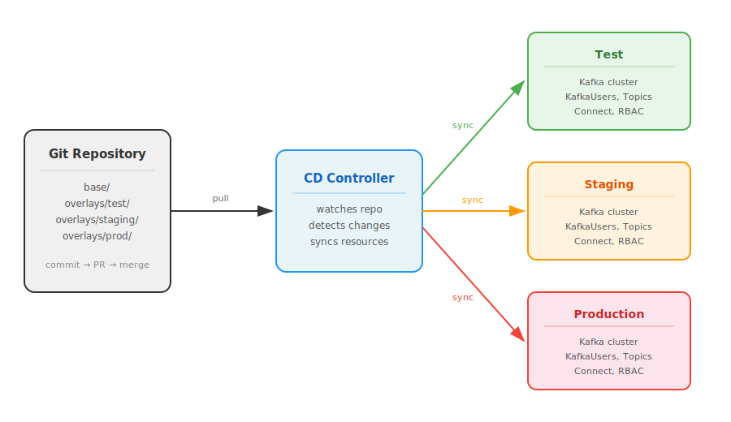

+++
title = 'Introduction to GitOps'
+++

Most of us start managing infrastructure by clicking through web consoles.
It works, and it's easy to learn.
But when systems grow and more people are involved, this approach starts causing problems.
This document explains what ClickOps is, why it can be painful in production, and how GitOps helps.

## What is ClickOps?

ClickOps means managing infrastructure by clicking through web consoles and admin UIs.
Need a new Kafka topic?
Log in to the console, fill in the form, click "Create".
Need to give someone access to a namespace?
Go to IAM settings, find the role, assign it, click "Save".

This is fine for trying things out or learning.
The problems start when teams use this for production.

## The problems with ClickOps

### Audit logs without context

Most platforms have audit logs.
Kubernetes has audit logging, cloud providers have tools like AWS CloudTrail, OpenShift has event history.
But these logs record low-level API calls ("user X updated ConfigMap Y at 14:32"), not *why* someone made a change.
When you need to understand what a colleague did and why, you end up going through audit logs, Slack messages, tickets, and asking around.

### Drift and inconsistency

When people do things by hand, they do them slightly differently.
Two engineers setting up the same thing will pick slightly different values, miss different labels, or skip different steps.
Over time, environments that should be the same start to differ in ways that are hard to notice and hard to debug.

### Reproducibility depends on discipline

If a cluster goes down and you need to recreate it, how do you do it?
With ClickOps, it depends on whether someone wrote down all the steps and kept that document up to date.
Usually, the running system *is* the documentation.
Once it's gone, you're left trying to put things together from audit logs, backups, and what people remember.

### Rollbacks take work

Some platforms support rollbacks.
Kubernetes tracks deployment history and `kubectl rollout undo` can revert a Deployment.
But this only covers some resources.
Rolling back a Kafka topic configuration, a ConfigMap, a set of RBAC rules, or a bunch of things that were changed together?
That's a manual process.
You have to figure out what the previous values were and re-apply them one by one.

## ClickOps in practice

Here are a few scenarios that show how these problems look in real life.

### "Deploy a Kafka cluster just like this one"

A team has a Kafka cluster in staging that took weeks to get right.
The brokers have specific resource limits, topics have tuned retention and replication settings, and there are Kafka Connect connectors pulling data from other systems.

The team lead asks a platform engineer to deploy the same cluster in a new production namespace.
The engineer opens the staging console and starts going through each resource, writing down the settings.
They create the new cluster in production, entering each value by hand.

They miss a few things.
The JVM options on the brokers are slightly different because they didn't check that panel.
One topic has a replication factor of 1 instead of 3 because they left the default.
A connector is pointing at the staging database endpoint because they copied the URL but forgot to change it.

These problems show up over the next weeks: messages get lost during a broker restart, connector data is wrong, brokers behave differently under load.

### "Set up a user with the same access as this one"

A new developer joins the team and needs the same Kafka and Kubernetes access as an existing team member.
The team lead asks an administrator to set it up.

The administrator opens the console and starts comparing.
They look at the existing developer's role bindings, then create matching ones for the new user.
They check the KafkaUser resources and try to copy the ACLs: read access to some topics, write access to others, permissions on consumer groups.

A week later, the new developer reports they can produce to a topic but can't consume.
The administrator missed a consumer group ACL.
Another week later, a security review finds the new developer has write access to a production topic that the existing developer doesn't have.
The administrator clicked the wrong topic name in a long dropdown.

### "What did someone change yesterday?"

It's Monday morning and the on-call engineer notices the event processing pipeline is dropping messages.
A colleague made some changes on Friday for a different issue, but they're on holiday this week.

The on-call engineer starts looking into it.
The Kubernetes audit logs show that several resources were updated on Friday, but the entries are just `PATCH` operations on ConfigMaps and custom resources.
No explanation of why, and no way to tell which changes are related.
The Kafka console shows the topic configuration, but was `retention.ms` always this value?
The Kubernetes dashboard shows the deployments, but were the resource limits always this low?

Three hours later, after going through Slack messages, audit logs, and comparing against screenshots from an old demo, the engineer figures it out.
The colleague reduced `max.poll.records` in a consumer application's ConfigMap to work around a timeout, and changed `retention.ms` on a topic as part of a cleanup.
Each change made sense on its own, but together they caused the pipeline to fall behind and drop messages when the retention window passed.

Now they need to roll back, but to what values?
The engineer isn't sure, so they message the colleague on holiday.
The colleague responds hours later with values from memory.

All three scenarios share the same root cause: there is no single place where the full state of the system is defined, reviewed, and versioned.
This is the problem that GitOps solves.

## What is GitOps?

GitOps is a way of managing infrastructure where you describe the desired state in files stored in a Git repository.
A controller watches the repository and keeps the live system in sync with what's in Git.

The main ideas:

- **Declarative configuration**: You describe infrastructure as YAML or JSON manifests, not as a list of manual steps.
- **Git as the source of truth**: The Git repository is the single record of what the system should look like. All changes go through Git.
- **Automated reconciliation**: A controller watches the Git repository and applies changes automatically, so the live state always matches what's declared. It can manage the cluster it runs in, or it can manage remote clusters from a central location.

The diagram below shows how this works in practice.
Changes go into the Git repository through pull requests.
Argo CD watches the repository, detects changes, and syncs resources to each environment.

## How GitOps solves the scenarios above

### Deploying "a Kafka cluster just like this one"

With GitOps, the staging cluster configuration lives in YAML files in a Git repository.
The common settings (resource limits, JVM options, replication factor) are defined once in a base configuration.
Environment-specific values like endpoints and namespaces go into separate overlays using [Kustomize](https://kustomize.io/).

Kustomize is a tool built into `kubectl` that lets you define a base set of Kubernetes resources and then apply patches or overrides per environment, without duplicating the whole configuration.
For example, you can have one `Kafka` resource in `base/` and only override the bootstrap endpoint and namespace in `overlays/prod/`.

There is no need to copy or re-type anything.
A pull request review would catch any mistakes before they reach production.

### Setting up "a user with the same access"

With GitOps, user access is defined as KafkaUser and RoleBinding manifests in the repository.
Adding the new developer means copying the existing user's files, changing the username, and opening a pull request.
The review catches any mistakes.
And because it's the same file with one field changed, the access is the same by definition, not by manual effort.

### Figuring out "what someone changed yesterday"

With GitOps, the on-call engineer would check the Git log.
They'd see what changed on Friday, with a commit message saying why.
Rolling back would be a `git revert` and a push.
The controller would apply the previous state in minutes.
The whole thing would take minutes, not most of a day.

### Summary

| ClickOps challenge                          | GitOps approach                                                                                |
|----------------------------------------------|------------------------------------------------------------------------------------------------|
| Audit logs show what happened, not why       | Git commits include a message explaining the reason for each change                            |
| Environments drift apart over time           | The declared state is the same for each environment, differences are explicit and reviewable    |
| Reproducibility depends on documentation     | The whole environment can be recreated from the repository                                     |
| Rollbacks are manual and partial             | `git revert` restores the previous state for all affected resources; the controller applies it |

## Common GitOps technologies

There are two main tools for GitOps in the Kubernetes ecosystem:

### Argo CD

[Argo CD](https://argo-cd.readthedocs.io/) is a Kubernetes native continuous delivery tool.
It runs in a cluster, watches Git repositories, and syncs resources to match what's in the repository.
It can manage the cluster it runs in, but it can also manage remote clusters, so you can run Argo CD on one cluster and have it deploy to several others.

It comes with a CLI for scripting and automation, and also has a web-based dashboard where you can see the state of all your applications, their sync status, health, and resource details.
The dashboard makes it easy to monitor what's deployed, spot problems, and see the diff between what's in Git and what's running in the cluster.

Key features:

- Built on Kubernetes custom resources
- Web dashboard with real-time view of applications, sync status, and resource health
- CLI for automation and scripting
- Works with Kustomize, Helm, and plain YAML
- Automated or manual sync with retry and self-healing
- SSO and RBAC for access control

### Flux

[Flux](https://fluxcd.io/) is another CNCF project for GitOps on Kubernetes.
It works similarly to Argo CD, with controllers in the cluster that reconcile resources against a Git repository.

Key features:

- Built on Kubernetes custom resources
- Works with Helm, Kustomize, and plain YAML
- Can automatically update manifests when new container images are published
- Multi-tenancy support at the namespace level
- Notification system for reconciliation events

### Choosing a tool

Both tools are mature and work well for production.
Both are built around the CLI and Git workflow.
Argo CD additionally provides a built-in web dashboard for monitoring and visibility, which can help teams get started with GitOps.

In this project, we use **Argo CD**.

## What's next

The rest of this documentation covers practical guides and examples for managing a streaming infrastructure portfolio using GitOps.
Check the other sections for setup instructions, configuration examples, and how-to guides.
