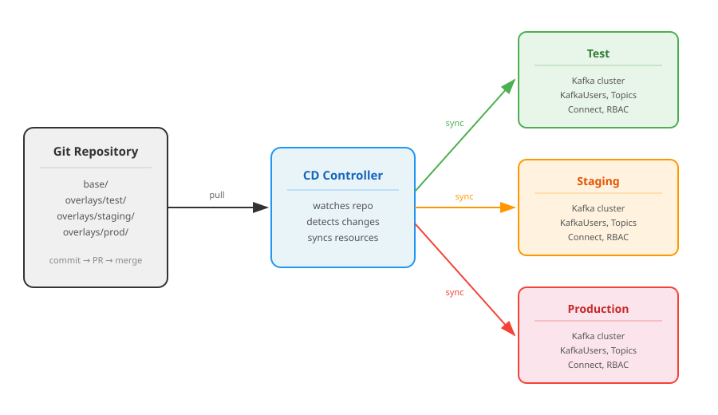

+++
title = 'Introduction to GitOps'
+++

Web consoles (ClickOps) often serve as an initial entry point for infrastructure management. 
However, manual configuration management creates operational challenges as systems and teams scale. 
Transitioning to a GitOps workflow addresses these challenges.

## ClickOps overview

ClickOps refers to managing infrastructure by using web consoles and administration user interfaces.

Typical ClickOps tasks include:

* Creating an event streaming topic by filling out a form in a management console and selecting "Create".
* Assigning namespace access permissions by navigating to an Identity and Access Management (IAM) panel, assigning a role, and clicking "Save".

While manual console management is effective for initial exploration and lower environments, relying on ClickOps to manage production infrastructure leads to several operational challenges.

## Operational challenges of ClickOps management

### Configuration drift and environmental inconsistency

When you perform configuration tasks manually, execution varies across team members. 
Two engineers configuring identical systems might select different parameters, omit required labels, or skip deployment steps. 
Over time, environments that require identical states diverge, creating inconsistencies that are difficult to detect and troubleshoot.

### Audit logs lacking operational context

Most platforms have audit logs.
Platform logging features—such as Kubernetes audit logs, AWS CloudTrail events, and Red Hat OpenShift event histories record low-level API operations, such as a user updating a ConfigMap object. 
However, these logs do not record the rationale behind a change. 
Investigating the cause of an incident requires cross-referencing audit entries, chat histories, support tickets, and team recollections.

### Documentation-dependent reproducibility

Rebuilding a failed cluster or provisioning a duplicate environment requires comprehensive, up-to-date documentation. 
In ClickOps environments, the active cluster often serves as the only record of truth. 
If a deployment fails or is deleted, recovering the environment relies on audit logs, system backups, and personal recall. 
Even if the original deployment is running, the risk of omitting custom settings remains.

### Complexity of manual rollbacks

Some platforms support rollbacks. 
While you can revert Kubernetes deployments by using `kubectl rollout undo`, rolling back non-deployment resources requires manual updates. 
To revert changes to `ConfigMap` objects, Kafka topics, or role-based access control (RBAC) rules, you must identify and reapply previous configuration values individually.

## Limitations of ClickOps in real-world scenarios  

Real-world production scenarios highlight the operational limitations of manual console configuration (ClickOps), including inconsistent cluster duplication, access control errors, and undocumented changes.

### Inconsistent cluster duplication

Manually duplicating a customized Apache Kafka cluster across namespaces requires copying settings resource-by-resource, which introduces human error.

Examples of possible omissions during manual cluster duplication include:

* **Uncopied broker parameters:** Omitting custom JVM options from management panels.
* **Default parameter retention:** Leaving topic replication factors at default values (such as 1 instead of 3).
* **Mismatched service endpoints:** Copying connector configurations directly without updating database URLs causes production applications to connect to staging endpoints.

In subsequent weeks, these configuration gaps manifest as critical production failures, including lost messages during broker restarts, incorrect connector data, and inconsistent broker behavior under load.

### Access control configuration errors

Manually replicating permissions for a new user across Kubernetes role bindings, Apache Kafka user resources (KafkaUser), and Access Control Lists (ACLs) introduces security and access risks.

Manual permission assignment often leads to issues such as:

* **Omitted permissions:** Missing consumer group ACLs prevents users from consuming messages.
* **Excessive access rights:** Selecting incorrect topic names from interface drop-down menus grants the new user unauthorized write permissions to production topics.

### Undocumented concurrent changes

When multiple engineers apply manual updates without centralized tracking,  troubleshooting incidents requires searching through incomplete logs and team messages.
Although Kubernetes audit logs confirm that updates occurred, they provide no rationale for why changes were made or how individual updates relate to one another.

For example, two concurrent manual updates can interact to cause pipeline failures:

* Decreasing `max.poll.records` in a consumer application ConfigMap to prevent processing timeouts.
* Reducing `retention.ms` on a Kafka topic during routine cleanup.

Independently, each change is valid. Together, the changes caused the pipeline to fall behind and drop messages when the retention window expired. 

In this scenario, a roll back to the previous working configuration is required. 
However, restoring the previous state relies on personal recall rather than a version-controlled configuration repository.

### Summary

All three scenarios share a root cause: the lack of a version-controlled repository to define, review, and track the system state.  GitOps addresses this limitation by using Git as the single source of truth.

## GitOps overview

GitOps is a framework that manages infrastructure by storing the desired state in files in a Git repository. A controller monitors the repository and keeps the live system synchronized with the repository. 

GitOps relies on three core principles.

- **Declarative configuration**: Infrastructure and application resources are defined as declarative YAML or JSON manifests rather than as a list of manual steps.
- **Git as the single source of truth**: The Git repository stores the target state of your system. All changes pass through version-controlled pull requests, making the entire history of deployed configurations available for auditing.
- **Automated reconciliation**: A controller monitors the Git repository and automatically reconciles the live cluster state with the declared configuration.

The following diagram illustrates this workflow in practice. 
Configuration changes are submitted to the Git repository by using pull requests. 
An automated GitOps controller continuously monitors the repository, detects updates, and synchronizes target environments accordingly.

## GitOps solutions for ClickOps limitations

### Consistent cluster duplication

GitOps provides standardized cluster deployment. 
With GitOps, you store cluster configurations in YAML files in a Git repository. 
Common settings including resource limits, JVM options, and replication factors, are defined once in a base configuration.
To configure environment-specific parameters such as endpoints and namespaces, you can overlay specific values by using [Kustomize](https://kustomize.io/).

Kustomize is a tool integrated into the Kubernetes command-line client (`kubectl`) that allows you to define base resources and then apply patches or overrides per environment, without duplicating the whole configuration. 
For example, you can maintain a single `Kafka` resource in `base/` and override only the bootstrap endpoint and namespace in `overlays/prod/`.

All configuration updates are submitted through pull requests to the GitOps repository. 
This workflow means that pull request reviews, automated continuous integration testing, or both can catch errors before changes are deployed to production.

### Standardized user access management

In a GitOps workflow, you define user access to an Apache Kafka cluster in a `KafkaUser` custom resource and a RoleBinding YAML file in the repository.

To grant a new team member access, you copy an existing user's files, update the username, and open a pull request. The pull request review identifies any errors before deployment. Inheriting the access configuration directly from a verified configuration file with a single modified field ensures consistent permissions by design.

### Documentation-independent change history

GitOps provides auditable change history and automated rollbacks.
When investigating cluster incidents, you can inspect the Git commit log to review recent configuration updates and identify the reasons for the changes in the commit messages.

If a change causes a failure, you can revert the problematic commit by running `git revert` and push the update by using `git push`. 
The controller then automatically applies the previous validated state. 
The entire process involves significantly less effort for incident responders and reduces incident recovery time.

### Summary

| ClickOps challenge                          | GitOps approach                                                                                |
|----------------------------------------------|------------------------------------------------------------------------------------------------|
| Audit logs capture actions, not rationale    | Stores pull requests and Git commit messages explaining the reason for every change            |
| Environments diverge over time               | The declared state is the same for each environment, differences are explicit and reviewable   |
| Reproducibility depends on documentation     | The entire environment can be recreated from the repository                                    |
| Rollbacks are manual and partial             | `git revert` restores the previous state for all affected resources; the controller applies it |

## Common GitOps technologies

There are two main tools for GitOps in the Kubernetes ecosystem:

### Argo CD

[Argo CD](https://argo-cd.readthedocs.io/) is a Kubernetes-native continuous delivery tool that runs inside a cluster, monitors Git repositories, and reconciles live cluster resources against the repository. 
Argo CD can manage the local cluster where it is installed and also manage multiple remote clusters.

Argo CD provides a command-line interface (CLI) for automation scripts, as well as a web-based dashboard that displays application health, synchronization status, and resource details. 
The dashboard allows you to monitor deployed workloads, identify problems, and inspect configuration differences between Git and running clusters.

Argo CD includes the following key features:

- Built on Kubernetes custom resources
- Web dashboard displaying real-time application status, synchronization status, and resource health
- Command-line interface (CLI) for scripting and automation
- Compatibility with Kustomize, Helm, and YAML
- Automated and manual synchronization with retries and self-healing
- Single sign-on (SSO) and role-based access control (RBAC) integrations

### Flux

[Flux](https://fluxcd.io/) is another Cloud Native Computing Foundation (CNCF) project for Kubernetes GitOps workflows. Similar to Argo CD, Flux uses in-cluster controllers to reconcile cluster resources against a Git repository.

Flux includes the following key features:

- Built on Kubernetes custom resources
- Works with Helm, Kustomize, and YAML
- Can automatically update manifests when new container images are published
- Multi-tenancy support at the namespace level
- Notification system for reconciliation events

### Selecting a GitOps delivery tool

Both Argo CD and Flux are mature, production-ready tools structured around CLI operations and Git workflows.
Argo CD includes a built-in web dashboard for monitoring and visibility, which simplifies getting start with GitOps. While Flux does not include a native dashboard, external user interfaces such as [Capacitor](https://fluxcd.io/blog/2024/02/introducing-capacitor/) can provide similar monitoring capabilities.

In this project, Argo CD serves as the continuous delivery controller.

## What's next

### Try the interactive GitOps tutorial

To learn and practice real GitOps workflows, complete the hands-on, three-lesson [GitOps Tutorial](../gitops-tutorial/_index.md). The tutorial takes you through real GitOps workflows using Strimzi and Argo CD on a local Kubernetes cluster.

You begin the tutorial by making an initial configuration change and observing `Argo CD` automatically reconcile the cluster. Then, you learn how to:

* Manage multiple deployment environments
* Promote configuration updates from staging to production environments
* Use rollbacks to recover from deployment failures

Each lesson pairs a hands-on lab with a conceptual guide that explains the underlying concepts. Environment setup requires approximately 8 minutes. By completing this tutorial, you gain practical experience with the core GitOps workflow: edit, commit, push, and reconcile.

### Documentation and examples

Beyond the tutorial, the rest of this documentation covers practical guides and examples for managing streaming infrastructure using GitOps.
You can find configuration examples for common scenarios like deploying Kafka clusters, setting up OAuth-secured topics, configuring mirror makers for cross-cluster replication, and managing multiple applications with Argo CD ApplicationSets.
